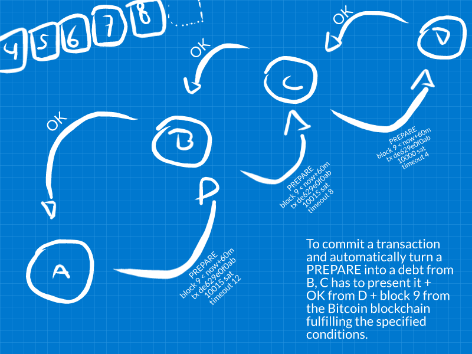

trustlines
==========

The **trustlines** protocol for decentralized payments based on mutual credit channels and IOUs.

Yes, there have been [a lot of attempts](https://listhub.xyz/fiatjaf/mutual-credit) to make this work since the old [Ryan Fugger's Ripple concept](http://ripple.ryanfugger.com/). All these attempts are unsound because they fail to solve the decentralized commit problem.

**trustlines** solves that in a very simple, reliable and free way: using Bitcoin blocks. When you start a trustlines transaction you choose a Bitcoin block height that is likely to be published in the near future, then that transaction becomes bound to it. If that block is published in a reasonable amount of time then all peers involved in the trustlines transaction will acknowledge that it happened.

Please note that it doesn't require any special transaction to be published to the Bitcoin blockchain and no transaction fees to be paid at all. It just assumes trustlines peers will be able to read the blockchain, not write to it.

Thus trustlines depend on another network and relies on the incentives on that network, but since **Bitcoin** is the world's money and has proven it to be solid enough for the most important world transactions **trustlines** assumes it's fine to rely on that.

Basically we just needed a trustworthy uncensorable clock and Bitcoin is that.

the protocol explained
----------------------

Suppose a set of peers `A`, `B`, `C`, and `D` with channels `A-B-C-D` (how these channels are published is not yet defined in the protocol, assume they're all public information for all nodes). We'll assume all payments are denominated in **satoshi**, as that is the world's common monetary unit (but of course the network is agnostic in regards to that and we could even have multi-currency transactions as long as one node in the path is willing to do the exchange).

Consider that `A` is sending a payment to `D` along the path `A-B-C-D`.

`A` sends a `PREPARE` message to `B` (inside that there could be an onion that should be sent from `B` to `C` and so on, but that's not defined by the protocol yet). That message works as a conditional IOU, in other words, in the future, if `B` presents `A` with that `PREPARE` message and with the other fulfillment conditions:

  * the Bitcoin block height at which the transaction should be considered committed;
  * the maximum timestamp for that block to arrive -- if the block at that height arrives later than that (or, say, never arrives) then it's not to be considered valid.
  * the transaction id, which should be a random value.
  * an amount in sat, which should be the final amount increased by the fees payable to nodes up to that point in the path.
  * a timeout (specified in number of blocks after the target Bitcoin block height) for this `PREPARE` message to be not more convertable into an IOU even after the specified
  * the next peer in the path, along with an onion containing the information it will need (which should be the same information just described).

In our example, a `PREPARE` message from `A` to `B` would contain the following (in human-readable words):

  * target: block 9 (replace this for 60009 or 70009 if you want)
  * maximum timestamp: current timestamp (for the node issuing the payment) plus 60 minutes (considering we're now on block 6 and each block takes on average 10 minutes, we give it 60 minutes and are fine with it)
  * transaction id: de629e0f0ab
  * amount in sat: 10015
  * timeout: 12
  * to node C: [encrypted data]

As the `PREPARE` messages reach `D`, `D` will know it is the last peer in the path and send back an `OK` message to `C`. `C` will send an `OK` message to `B` and so on, until it reaches `A`.

what if...?
-----------

  - **What if the `PREPARE` messages stop at `B` or `C` and never reach `D`?**

    Since no one has `OK` messages from anyone all peers can happily forget about this failed payment attempt as soon as the target block + timeout arrives. After that point everyone is guaranteed to not have any pending IOU with anyone else.

  - **What if the target block is published but `A` hasn't gotten an `OK` message from `B` yet?**

    That doesn't mean the payment is failed or is left uncommitted, just that `A` is not sure yet of what happened. If after its specified timeout it still hasn't gotten an `OK` from `B` then it means the payment has failed, otherwise it can consider the transaction successful at the moment it receives an `OK` from `B`.

    This should be an anomalous situation, as it would mean the payment is taking a lot or the Bitcoin blockchain has experienced a surge in mining or miner luck.

  - **What if `C` delays the return of its `OK` message to `B` and then suddenly presents it, after `A`'s `PREPARE` message has already timed out?**

    That will never happen, as `A`'s `PREPARE` message will have a timeout greater than  `B`'s `PREPARE` message, thus `C`'s `OK` will not mean anything to `B` anymore. `B` will not owe anything to `C`.

  - **What if `B` refuses to accept `B`'s `OK` message while it's still not timed out just so `B` can claim afterwards that it doesn't owe `C` anything?**

    In that situation, `C` still owes `D`, and `A` doesn't owe `B` anything. The only problem is between `B` and `C`. Since it was `C` who had chosen to trust `B` beforehand there's nothing we can do to save it. `C` is likely then to eat that loss and close its channel with `B`. If `C` goes berserk and decides to not pay `D` after all, again it's a problem between `D` and `C`.
